# Guía del operador

**Versión 1.3 · 17 de septiembre de 2026 · Traducida y actualizada para la sesión de handoff con
Pavel de hoy. Es la versión en español de `docs/OPERATOR_GUIDE.md` (v1.2), cierra parte de
W-102.** Léela antes de la sesión de handoff, no durante. Trae las preguntas que la sesión no
conteste; cada una queda registrada, porque un hueco que esta guía no cubre es un defecto de la
guía, no tuyo.

*Nota sobre el idioma: la interfaz de GitHub y de Cloudflare que vas a ver en pantalla está en
inglés. Esta guía te dice qué hace cada botón en español, pero deja el texto exacto del botón
entre comillas en inglés (por ejemplo **"Commit changes"**) para que lo reconozcas en la
pantalla real.*

*Actualizado 17 de septiembre de 2026: se agregó al Part 2 el formulario de carga de contenido
(`apps/content-form`, W-111) como la forma más simple de editar una página que ya existe o los
campos de marca/SEO, sin tocar GitHub para nada. Probado de punta a punta contra el repo real
hoy mismo — PR de prueba creado, checks verdes, comentario de preview, PR cerrado. Ver
`BITACORA.md`, 17 de septiembre de 2026. El camino de GitHub (ahora "Part 2b") sigue siendo
necesario para crear páginas nuevas, algo que el formulario todavía no hace.*

*Actualizado 9 de septiembre de 2026: se agregó al Part 2 una sección nueva, "Publicar un lote
completo de páginas de una vez," para lanzar todo el contenido real de un sitio en un solo pull
request en vez de uno por página. Probado en vivo contra el contenido real del Sitio #1, ver
`BITACORA.md`, 9 de septiembre de 2026.*

*Actualizado 8 de septiembre de 2026: se agregó el Part 2 original, los pasos exactos de
GitHub, clic por clic. El primer borrador asumía que ya sabías usar git y GitHub; esa suposición
era incorrecta, y esta versión no la repite. Todo el Part 2 se probó de verdad sobre este repo
antes de escribirse — ver `BITACORA.md`, 8 de septiembre de 2026.*

Esta es la guía, no el material de referencia. Te dice qué es este repo, qué tocás vos, qué no
tocás nunca, y cómo se ve una semana real. Cuando necesites los campos exactos del schema, las
reglas de contenido, o el checklist de lanzamiento, te manda al documento que tiene esa
respuesta en vez de repetirla acá desactualizada.

## Part 1 — El modelo mental

### Esto es una fábrica, no un sitio web

Este repo no contiene un sitio. Contiene el sistema que genera sitios. Un microsite es el
resultado de un archivo de configuración más una carpeta de markdown, procesados por un template
compartido. Nadie abre un archivo HTML y lo edita a mano. Si un sitio necesita algo que el
template hoy no puede producir, eso es un hueco del template, y el arreglo pasa una sola vez, en
el template, para todos los sitios a la vez — no parchando a mano el único sitio que lo
necesitaba.

Esto importa por una razón concreta: dos cosas en tu propio documento de planeación asumían un
modelo distinto al que este framework realmente usa, y vale la pena nombrar ambas directamente
para que no reaparezcan en octubre sin que nadie las haya hablado.

**Los sitios se generan, nunca se construyen a mano.** Tu documento describía construir sitios a
mano. Acá, un sitio es `sites/<slug>/site.config.json` más `sites/<slug>/content/*.md`, y el
generador convierte eso en el sitio en vivo. Vos nunca tocás HTML, CSS, ni el código del
template. Si en algún momento sentís que querés hacerlo, parate y avisá. Querer editar un
archivo del template casi siempre significa que al template le falta algo, y eso es un cambio de
framework, no un parche por sitio.

**Vos escribís el contenido. Nada se publica desde un brief generado por IA.** Tu documento
proponía contenido generado desde briefs. `docs/CONTENT_STANDARDS.md` traza esta línea de forma
explícita, y pesa más de lo que parece: la política de "scaled content abuse" de Google aplica
"sin importar cómo se haya creado", y cien páginas escritas desde un brief y generadas en volumen
es exactamente el perfil que esa política persigue. La IA está bien como ayuda de borrador o
investigación que después vos editás hasta que sea verdadero y específico. No está bien como el
pipeline que publica una página. Cada página que publicás, la escribiste vos, en el idioma en que
está escrita. El contenido en español especialmente: escrito en español desde el inicio, nunca
traducido ni generado desde un brief en inglés. Números de licencia reales, detalle local real,
tu propio conocimiento del mercado en el texto.

Ninguna de las dos cosas fue un error tuyo. Nadie te había explicado estas reglas cuando
escribiste ese documento. Quedan escritas ahora para no tener que reexplicarlas sitio por sitio.

### Qué tocás y qué nunca tocás

**Tuyo, siempre:**
- `sites/<slug>/site.config.json` — el sitio en el que estás trabajando
- `sites/<slug>/content/*.md` — sus páginas
- `sites/<slug>/public/` — su logo y cualquier otra imagen de marca, una vez que exista (ver más
  abajo)

**Nunca, bajo ninguna circunstancia:**
- `packages/template/` — el template compartido de Astro, layouts, componentes
- `packages/config-schema/` — el contrato contra el que valida cada config
- `scripts/` — el generador, el pipeline de build, la lógica de CI
- `.github/workflows/` — CI, preview deploys, deploys de producción
- El `sites/<otro-slug>/` de cualquier otro sitio

Si algo de esa segunda lista necesita cambiar para que tu sitio funcione, ese arreglo no es tuyo.
Avisá. Un campo de config que falta, un layout del template que no puede hacer lo que una página
necesita, un error de build que no tiene que ver con tu contenido: todo eso son preguntas de
framework, y Gate A (13 de noviembre) mide en parte justo este límite. `git diff --name-only`
contra tus propios commits solo debería mostrar archivos bajo `sites/<tu-slug>/`.

### Cómo se ve una semana real, durante el Sitio #1 (21 sep – 9 oct)

A grandes rasgos, en el orden en que pasa:

1. Definí la página o el sitio con la skill `microsite-brief` si estás arrancando de cero —
   produce el config, el mapa de páginas y el plan de diferenciación antes de generar nada.
2. Escribí el markdown, página por página. Conforme cada página queda escrita, corré la skill
   `differentiation-audit` sobre ella. No al final de la semana, no antes del lanzamiento: en la
   página, mientras todavía es barato corregirla. Este es el hábito más importante de toda esta
   guía. Saltearlo no bloquea nada hoy, que es exactamente por qué es el paso que se saltea, y
   exactamente por qué `docs/CONTENT_STANDARDS.md` lo señala por nombre.
3. Subí una rama (o, para una edición simple, usá el formulario — ver Part 2a). Un pull request
   te da automáticamente una URL de preview en vivo, publicada como comentario y actualizada en
   cada push. No necesitás tener un servidor local corriendo para ver tu trabajo renderizado; eso
   también existe (`docs/SETUP.md`) pero es una comodidad, no un requisito.
4. Antes de pedir que se mergee, corré el checklist de autorevisión de `docs/CONTENT_STANDARDS.md`
   y el checklist completo de lanzamiento de `docs/QA_CHECKLIST.md`. Ambos son tuyos para correr;
   por ahora nadie más revisa antes que vos (ver la nota sobre esto más abajo).
5. Mergeá. Una vez que el deploy de producción real esté activado para un sitio, eso es lo que lo
   publica en vivo.

### Quién revisa tu contenido

Por ahora, nadie más. El checklist de autorevisión de `docs/CONTENT_STANDARDS.md` existe porque
hoy no hay una segunda persona en el equipo dedicada a revisar. Podés preguntarle a Kevin de
manera informal cuando algo te parezca ambiguo — un claim de cobertura, un caso límite que solo
un agente licenciado debería afirmar — pero esa consulta es decisión tuya, no un paso de
aprobación obligatorio. Esto es un piso, no un reemplazo de revisión licenciada, y se revisa de
nuevo si el portafolio crece más allá de los tres sitios piloto. No se te está pidiendo cargar
más riesgo en silencio; queda escrito a propósito como un hueco conocido.

## Part 2 — Cómo hacerlo: dos caminos, del más simple al más completo

El Part 1 te dijo qué tocás y por qué. Esta parte es el "cómo", en dos caminos:

- **Part 2a — El formulario de contenido.** El camino más simple, sin ningún concepto de git.
  Sirve para editar el markdown de una página que ya existe, o los campos de marca/SEO. No sirve
  todavía para crear una página nueva.
- **Part 2b — GitHub, clic por clic.** El camino completo, necesario para crear páginas nuevas o
  para publicar un lote de páginas de una vez. Cada paso de esta sección se probó de verdad sobre
  este repo antes de escribirse, no de memoria de cómo funciona GitHub en general.

Si lo que necesitás hacer hoy es "cambiar un párrafo de una página que ya existe" o "actualizar
el título de SEO", andá directo al Part 2a. Si necesitás crear una página que no existe todavía,
andá al Part 2b.

### Part 2a — El formulario de contenido (el camino simple)

Esto es `apps/content-form` (ítem de backlog W-111): un formulario propio, aislado del resto del
repo, pensado exactamente para que vos publiques un borrador sin tener que entender rama, commit,
ni pull request. Por dentro sigue creando una rama y abriendo un pull request igual que el camino
de GitHub — nada más lo hace por vos, con botones en español conceptual en vez de vocabulario de
git.

1. Entrá a `https://wicfl-content-form-w111.wicfl-microsites.workers.dev`.
2. Iniciá sesión con la contraseña compartida (la misma que usa el equipo para este formulario —
   pedísela a Vic si no la tenés, vive en el vault del proyecto, nunca por chat).
3. Elegí el sitio en el selector, y después la página que querés editar.
4. Vas a ver dos tipos de campos:
   - **Nombre de marca y SEO** (`brand.name`, título y descripción de SEO, palabra clave
     primaria y secundarias) — los únicos campos de `site.config.json` que este formulario deja
     tocar. El resto del config (dominio, contacto, licencia, analytics) sigue siendo terreno de
     Vic.
   - **El markdown de la página elegida**, en un cuadro de texto grande. Es el mismo formato que
     ves en el Part 2b: `## Título` para un encabezado, línea en blanco entre párrafos,
     `[texto del link](/otra-pagina/)` para un link interno.
5. Editá lo que necesites y hacé clic en **"Publish draft."** Esto crea el pull request por vos,
   automáticamente.
6. El formulario te muestra un link al pull request creado (algo como `.../pull/12`). Abrilo:
   vas a ver exactamente la misma página de checks y de preview que describe el Part 2b más
   abajo (pasos 9 a 11) — esa parte no cambia, el formulario solo te ahorra los pasos de crear la
   rama y el PR a mano.
7. **El formulario nunca mergea nada.** Alguien (vos mismo, o Vic si preferís una segunda mirada)
   tiene que entrar al pull request y apretar "Merge pull request" una vez que los checks estén
   verdes y el preview se vea bien — el mismo paso 12 del Part 2b.

**Lo que este formulario todavía NO hace:** crear una página nueva, publicar un lote de varias
páginas de una vez, o tocar cualquier campo de `site.config.json` fuera de marca/SEO. Para
cualquiera de esas tres cosas, seguís necesitando el Part 2b.

### Part 2b — GitHub, clic por clic, sin asumir nada

### Un glosario corto

Vas a ver estas palabras en GitHub mismo y en el resto de esta guía. No necesitás entender git
como sistema, solo qué significan estas palabras puntuales acá.

- **Repo (repositorio)** — los archivos del proyecto y toda su historia, todo junto. Este vive en
  `github.com/microsites-wicfl/wicfl-microsites`.
- **`main`** — la única copia del repo que es "la real." Todo lo que está en vivo, o a punto de
  estarlo, sale de `main`.
- **Rama (branch)** — una copia paralela y separada de los archivos donde podés hacer cambios sin
  tocar `main` todavía. Cuando editás un archivo en el sitio web de GitHub, GitHub crea una de
  estas por vos, automáticamente. Vas a ver un checkbox para esto, pero nunca tenés que
  nombrarla ni administrarla vos mismo.
- **Commit** — una foto guardada de las líneas exactas que cambiaste, con un mensaje corto. GitHub
  lo crea cuando hacés clic en "Commit changes."
- **Pull request (PR)** — un pedido para traer los cambios de tu rama a `main`. Es una página
  donde vos (y, si algo falla, Vic) pueden ver exactamente qué cambió, y donde corren checks
  automáticos antes de que nada se mergee.
- **Checks** — trabajos automáticos que corren en cada pull request. `Validate and build` revisa
  que tu config y tu contenido estén bien formados y construye el sitio para confirmar que nada
  se rompió. `Preview deploy` publica una copia temporal, en vivo, de tu cambio exacto, para que
  puedas ver la página real renderizada antes de que se acerque a producción. Un check verde
  significa que pasó; una X roja significa que algo está mal — ver "Si un check falla" más abajo.
- **Merge** — incorporar los cambios de tu rama a `main`. Es el único paso que se siente
  permanente; todo lo anterior se puede abandonar sin dejar rastro.

### Editar una página que ya existe

1. Andá a `github.com/microsites-wicfl/wicfl-microsites` e iniciá sesión.
2. Hacé clic en `sites/<tu-sitio>/content/`, y después en el archivo `.md` que querés cambiar
   (por ejemplo `flood-coverage.md`).
3. Hacé clic en el ícono de lápiz arriba a la derecha de la vista del archivo ("Edit this
   file").
4. Editá el texto. Es markdown simple: `## Encabezado` para un título, una línea en blanco entre
   párrafos, `[texto del link](/algun-slug/)` para un link. Si no estás seguro de cómo se va a
   ver un fragmento de markdown una vez renderizado, para eso justo sirve el paso de preview de
   más abajo.
5. Bajá hasta el final. Debajo de "Commit changes," escribí un mensaje corto describiendo qué
   cambiaste (por ejemplo "Update flood deductible figures").

   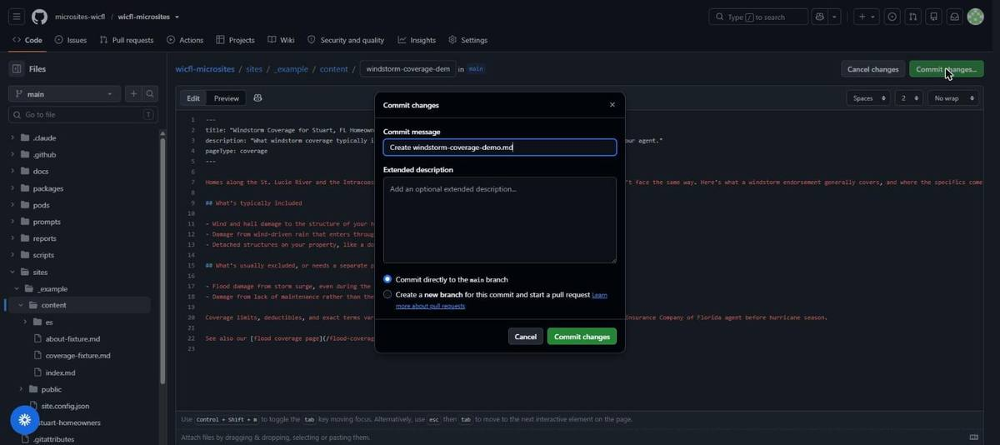

6. Asegurate de que esté seleccionada la segunda opción: **"Create a new branch for this commit
   and start a pull request."** No la primera — esa intenta guardar directo en `main`.

   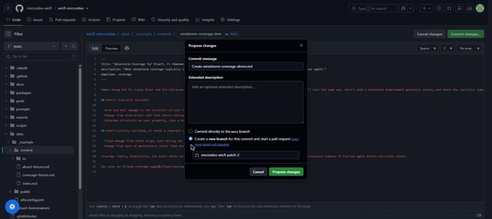

7. Hacé clic en **"Propose changes."**
8. Llegás a una página de "comparing changes." La caja de título viene prellenada desde tu
   mensaje de commit — editala si querés algo más claro. Hacé clic en **"Create pull request."**

   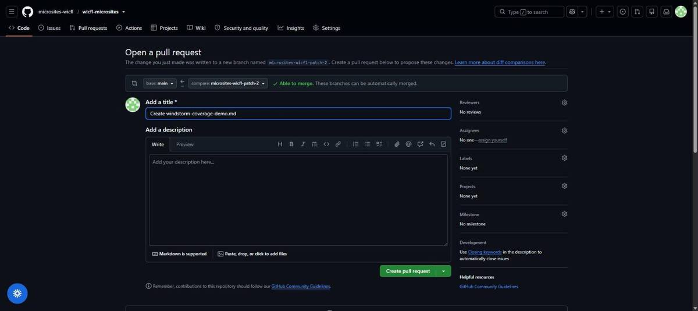

9. Ya estás en la página del pull request. Esperá un minuto o dos, recargando si hace falta,
   mientras corren los dos checks automáticos.

    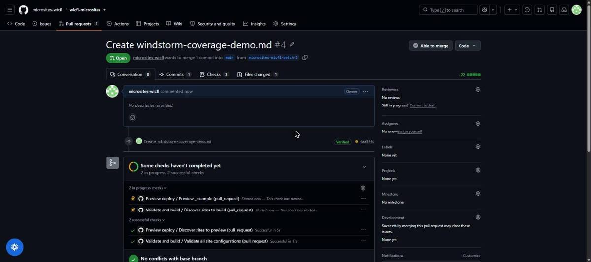

10. Cuando `Preview deploy` termine, aparece un comentario en el PR de GitHub Actions con un link
    parecido a `https://wicfl-prNN-<slug>.wicfl-microsites.workers.dev`. Hacé clic ahí: es tu
    cambio exacto, en vivo, antes de que nadie más lo vea.

    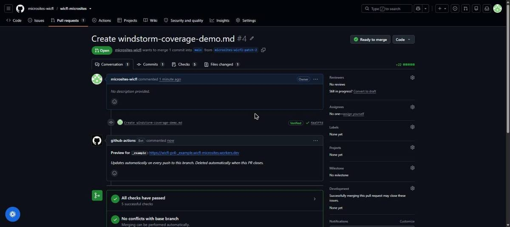

11. Mirá la página real. Después corré el checklist de autorevisión de `docs/CONTENT_STANDARDS.md`,
    y `docs/QA_CHECKLIST.md` si esta es una pasada de listo-para-lanzar.
12. Si ambos checks están verdes y el preview se ve bien, hacé clic en el botón verde **"Merge
    pull request,"** y después en el botón de confirmación que aparece debajo. Después, GitHub
    ofrece un botón **"Delete branch"** — hacé clic ahí; la rama era solo andamiaje para el PR.

    

13. `main` ya tiene tu cambio. El Worker temporal de preview se borra solo, unos minutos después
    de que el PR se cierra, mergeado o no — eso es esperado, y es algo separado del sitio real y
    permanente.

### Crear una página nueva

Una página es un archivo markdown. Acá está la receta exacta.

1. Andá a `sites/<tu-sitio>/content/` en el repo.

   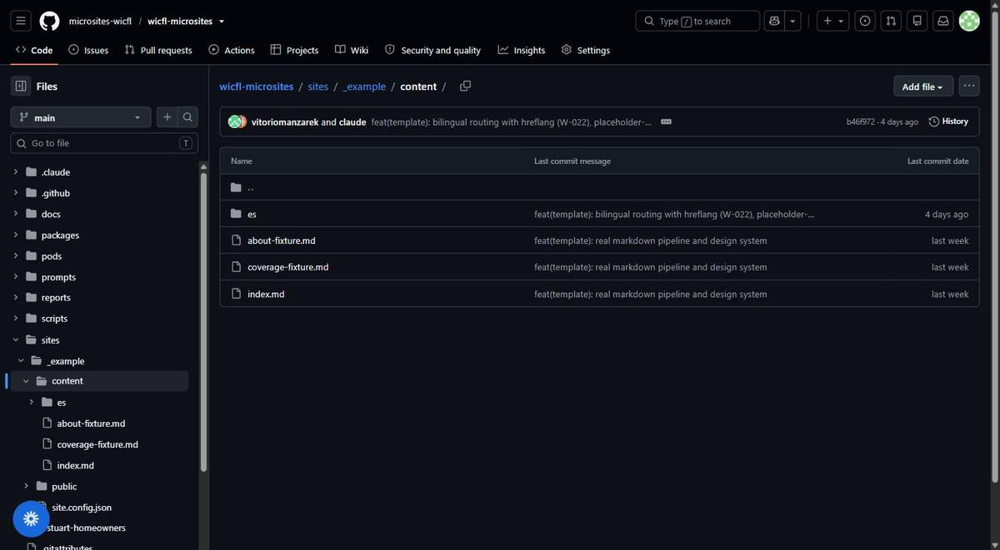

2. Hacé clic en el desplegable **"Add file"** cerca de arriba a la derecha del listado, y
   después en **"Create new file."**

   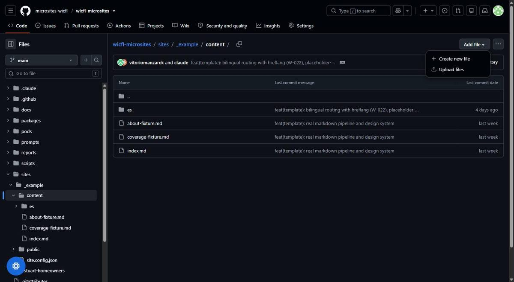

3. En el campo **"Name your file..."**, escribí un nombre de archivo terminado en `.md`:
   palabras en minúscula separadas por guiones, sin espacios — por ejemplo
   `flood-coverage.md`. **Ese nombre de archivo se convierte automáticamente en la dirección web
   de la página**, una vez que está en vivo: `flood-coverage.md` se convierte en la página en
   `/flood-coverage/`. No existe un campo separado de "URL" en ningún lado; el nombre del
   archivo es la dirección, así que acertalo la primera vez (renombrar el archivo después cambia
   la URL de la página).

   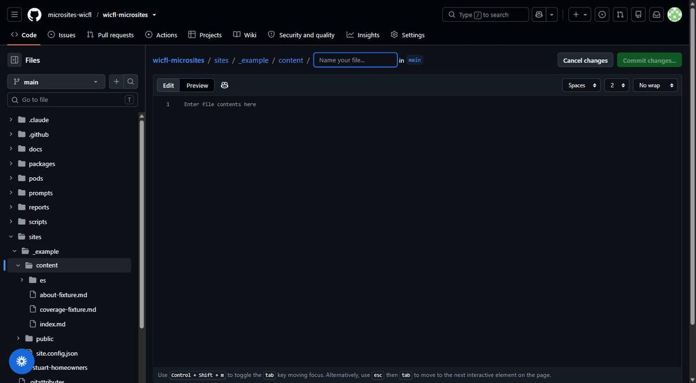
   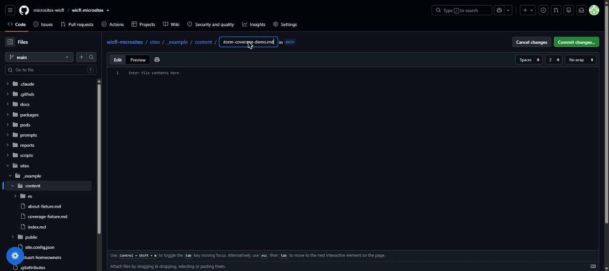

4. En el editor, lo primero que tiene que aparecer en el archivo es un bloque de frontmatter:
   tres guiones, algunos campos, tres guiones, antes de cualquier contenido real.

   ```
   ---
   title: "Flood Coverage in Miami-Dade"
   description: "What flood insurance covers and doesn't, explained plainly."
   pageType: content
   ---

   Tu contenido empieza acá, como markdown normal.
   ```

   Así se ve esto escrito de verdad en el editor real, usando el ejemplo trabajado de más abajo:

   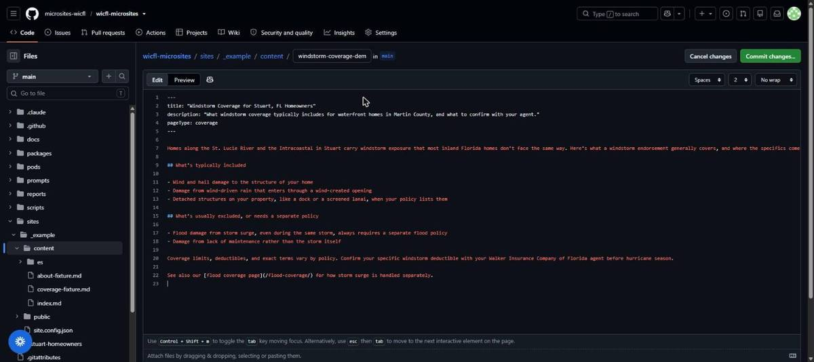

   - `title` — obligatorio. El título de la página y el título de la pestaña del navegador.
   - `description` — opcional, pero escribí uno igual; es lo que aparece en los resultados de
     búsqueda y en las vistas previas de redes sociales.
   - `pageType` — obligatorio, y tiene que ser exactamente una de tres palabras: `home`,
     `content`, o `coverage`. Cada sitio tiene exactamente una página `home` (`index.md`, su
     portada — no crees una segunda). Para todo lo demás usá `content`, salvo que la página sea
     específicamente sobre qué cubre o no cubre un tipo de cobertura, en cuyo caso `coverage` le
     da un tratamiento visual chico (una línea divisoria bajo el encabezado) hecho para eso. Si
     genuinamente no estás seguro entre `content`/`coverage`, usá `content` y preguntale a Vic —
     es una decisión de estilo, no algo que pueda romper el build.
   - Nada más va en ese bloque. Un nombre de campo que no exista acá va a hacer fallar el check
     `Validate and build` — eso es el schema haciendo su trabajo, no un bug.
5. Bajá y commiteá exactamente como en los pasos 5–13 de arriba: rama nueva, pull request,
   esperar los checks, preview, revisión, merge.

**Lo único que te va a morder si te lo saltás:** este sitio no tiene ningún menú de navegación
todavía — sin links en el header, sin mapa en el footer, nada que liste las páginas
automáticamente. Una página que publicás así queda en vivo en su URL, pero inalcanzable para
cualquiera que navegue el sitio a menos que otra página la enlace. Así que antes de mergear una
página nueva, editá al menos una página existente (la home suele ser la elegida) y agregale un
link de markdown simple hacia ella, por ejemplo
`[Flood coverage in Miami-Dade](/flood-coverage/)` — como parte del mismo pull request o de uno
posterior. Una página a la que nada enlaza es una página que Google y cualquier visitante real
nunca van a encontrar.

*(Nota del 17-sep: este hueco de navegación tiene un arreglo ya diseñado en el backlog, W-116,
pendiente de correrse. Cuando se cierre, esta advertencia se actualiza.)*

### Un ejemplo trabajado: cómo se ve de verdad el markdown de una página terminada

El contrato de frontmatter de arriba son solo tres líneas. Acá tenés un ejemplo completo de cómo
se ve una página real una vez escrita, estructura incluida, para que tengas algo con qué
comparar en vez de un editor en blanco. **No copies este texto en una página real** — las
oraciones de abajo son ilustrativas, no son copy investigado ni aprobado, y
`docs/CONTENT_STANDARDS.md` exige que cada página real sea tu propia escritura, específica para
ese mercado:

```
---
title: "Windstorm Coverage for Stuart, FL Homeowners"
description: "What windstorm coverage typically includes for waterfront homes in Martin
  County, and what to confirm with your agent."
pageType: coverage
---

Homes along the St. Lucie River and the Intracoastal in Stuart carry windstorm exposure that
most inland Florida homes don't face the same way. Here's what a windstorm endorsement
generally covers, and where the specifics come down to your policy and your agent.

## What's typically included

- Wind and hail damage to the structure of your home
- Damage from wind-driven rain that enters through a wind-created opening
- Detached structures on your property, like a dock or a screened lanai, when your policy
  lists them

## What's usually excluded, or needs a separate policy

- Flood damage from storm surge, even during the same storm, always requires a separate flood
  policy
- Damage from lack of maintenance rather than the storm itself

Coverage limits, deductibles, and exact terms vary by policy. Confirm your specific windstorm
deductible with your Walker Insurance Company of Florida agent before hurricane season.

See also our [flood coverage page](/flood-coverage/) for how storm surge is handled separately.
```

Este ejemplo es en inglés porque el Sitio #1 es en inglés — el equivalente en español que vas a
escribir para el Sitio #2 sigue exactamente la misma estructura de frontmatter, solo con tu
propio contenido en español real, nunca traducido de este ejemplo.

Este archivo exacto se creó y se previsualizó en vivo el 8 de septiembre de 2026, para confirmar
que toda la receta funciona de punta a punta antes de escribirla acá — el nombre del archivo por
sí solo produjo esta página, en su propia URL, sin ningún cambio de código en ningún lado:

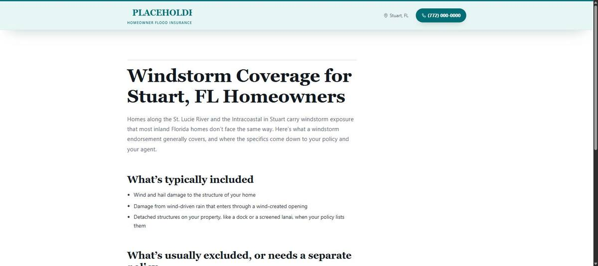

Fijate qué está haciendo cada parte, y por qué está ahí:

- **Detalle real y local** ("St. Lucie River," "Martin County," "dock," "screened lanai") — esto
  es exactamente lo que busca la prueba de intercambio (swap test) de
  `docs/CONTENT_STANDARDS.md`. Si intercambiás la ciudad, la mayor parte de este párrafo deja de
  ser verdad, que es justo el punto.
- **Lenguaje calificado** ("generally," "typically," "usually," "confirm with your agent") —
  nunca un claim garantizado o absoluto ("always covered," "guaranteed approval"). Ese es el
  ítem 3 del checklist de autorevisión.
- **Sin número de licencia, sin disclaimer de la entidad tipeado a mano** — el template los
  renderiza automáticamente desde `site.config.json` en cada página. Si te encontrás tipeando un
  número de licencia dentro de un archivo de contenido, parate, es una señal de que algo está
  mal.
- **Un link interno** (`[flood coverage page](/flood-coverage/)`) — sintaxis simple de link de
  markdown, apuntando al slug de otra página. Así es también cómo una página recibe enlaces, no
  solo cómo enlaza — ver la advertencia de arriba sobre páginas inalcanzables desde ningún lado.
- **`pageType: coverage`** — porque esta página trata específicamente sobre qué cubre y qué no
  cubre un tipo de cobertura. Una página general (una página "About", una página de área de
  servicio) usaría `content` en cambio.

### Publicar un lote completo de páginas de una vez (cómo se ve el primer contenido real de un sitio nuevo)

Todo lo de arriba camina página por página. Cuando estás lanzando todo el contenido real de un
sitio de una vez, como el Sitio #1 el 9 de septiembre de 2026, estás haciendo la misma receta
siete u ocho veces antes de abrir un solo pull request, para que los checks y el preview corran
una sola vez para todo el lote en vez de una vez por página. Acá está la secuencia exacta,
probada en vivo sobre `stuart-homeowners` — ver `BITACORA.md`, 9 de septiembre de 2026.

1. **Escribí el frontmatter y el contenido de cada página en otro lado primero** — un editor de
   texto, un doc, cualquier lugar fuera de GitHub — antes de tocar el navegador. Estás por pegar
   siete u ocho archivos seguidos; componerlos en vivo en el editor es cómo se cuela sin que nadie
   lo note un carácter suelto o un campo de frontmatter olvidado.
2. Andá a `sites/<tu-sitio>/content/`, hacé clic en **"Add file" → "Create new file,"** igual que
   los pasos 1-2 de "Crear una página nueva" de arriba, pero solo para tu **primera** página.
3. Nombrá el archivo, pegá su frontmatter y contenido, igual que los pasos 3-4 de arriba.
4. Bajá hasta **"Commit changes..."**. Esta vez, seleccioná **"Create a new branch for this
   commit and start a pull request,"** y antes de hacer clic, reemplazá el nombre de rama
   autogenerado (algo como `<vos>-patch-2`) por algo corto y legible, por ejemplo
   `site1-real-content`. Hacé clic en el botón que crea la rama.
5. Llegás a la misma página "Open a pull request" que antes. **Todavía no crees el pull
   request.** Todas las demás páginas todavía tienen que subirse a esta misma rama primero.
6. Para cada página restante, andá directo a esta dirección, con el nombre de tu rama y el slug
   de tu sitio en lugar de los placeholders:

   `github.com/microsites-wicfl/wicfl-microsites/new/<tu-nombre-de-rama>/sites/<tu-sitio>/content`

   Es exactamente la misma pantalla de "archivo nuevo" del paso 2, solo que ya apunta a tu rama
   en vez de a `main` — revisá la etiqueta chica junto al campo de nombre de archivo, debería
   decir **"in \<tu-nombre-de-rama>,"** no "in main."
7. Nombrá el archivo, pegá su contenido, bajá hasta **"Commit changes..."**. Como la rama ya
   existe, GitHub ahora por defecto va a mostrar **"Commit directly to the
   \<tu-nombre-de-rama> branch."** Eso es lo que querés esta vez — dejalo así, no toques los
   botones de radio, solo hacé clic en **"Commit changes."**
8. Repetí los pasos 6-7 para cada página restante.
9. Una vez que cada página está commiteada, andá a:

   `github.com/microsites-wicfl/wicfl-microsites/compare/main...<tu-nombre-de-rama>?quick_pull=1`

   Ponele al pull request un título que describa todo el lote (por ejemplo "Site 1: real
   content, 8 pages"), y una descripción listando cada página que incluye. Hacé clic en
   **"Create pull request."**
10. Esperá los checks, igual que el paso 9 de "Editar una página que ya existe" de arriba — esta
    vez van a ser más (5, no 2), porque construir y previsualizar un sitio entero con páginas
    nuevas necesita algunos jobs más que una edición de una línea, pero son el mismo tipo de
    checks y se comportan igual.
11. Hacé clic en el link de preview que comenta el bot. **Navegá varias páginas, no mires solo
    una** — abrí la home y al menos dos o tres de las páginas nuevas. Un lote de este tamaño
    puede tener un link interno roto incluso cuando cada página pasa la validación por separado.
12. Corré el checklist de autorevisión de `docs/CONTENT_STANDARDS.md` en cada página, no una sola
    vez para todo el lote.
13. Si todo está en orden, mergeá, confirmá, y borrá la rama, igual que los pasos 12-13 de
    arriba.

**Una diferencia respecto a un PR de una sola página:** el link temporal de preview desaparece a
los pocos minutos de mergear, igual que siempre, pero no hay otro link en vivo al que apuntar
después hasta que el sitio esté de verdad desplegado a producción (todavía condicionado a W-103
hasta el lanzamiento). Para ver qué se publicó después de mergear, el link duradero es el propio
pull request, no una URL en vivo — queda en GitHub para siempre y muestra exactamente qué cambió,
página por página.

### Si un check falla

Una X roja junto a `Validate and build` o `Preview deploy` en tu pull request significa que algo
está mal, generalmente un error de tipeo en el frontmatter (un `title` faltante, un `pageType`
que no es una de las tres palabras permitidas) o un desliz de sintaxis de markdown. Hacé clic en
la X roja, y después en "Details," para leer qué falló. Si el mensaje no deja obvio qué corregir,
no adivines y no empieces a editar archivos fuera de `sites/<tu-slug>/` para esquivarlo: copiá el
error y mandale un mensaje a Vic con un link al pull request. Un mensaje de error confuso es en
sí mismo algo que vale la pena reportar, no algo para rodear.

## Part 3 — Los documentos de referencia, y cuándo abrir cada uno

No leas todo esto de punta a punta antes del handoff. Repasá esta guía completa, repasá
`docs/ARCHITECTURE.md` para las decisiones y por qué se tomaron, y tratá el resto como
referencia que abrís cuando la situación de enfrente lo pide.

| Documento | Abrilo cuando... |
|---|---|
| `docs/ARCHITECTURE.md` | Querés las decisiones y el razonamiento detrás de ellas, una vez, antes del handoff |
| `docs/SITE_CONFIG_SCHEMA.md` | Estás llenando o depurando un `site.config.json` |
| `docs/SITE_CONFIG_SCHEMA.md`, decisión de diseño 7 | Estás agregando un logo — poné el archivo en `sites/<slug>/public/` y apuntá `brand.logo` a él |
| `docs/SITE_CONTENT_CHECKLIST.md` | Estás arrancando un sitio nuevo, o revisando qué tan cerca está uno existente de ser real en vez de placeholder — cada campo de config y cuántas páginas necesita un sitio, todo en un solo lugar |
| `docs/CONTENT_STANDARDS.md` | Estás escribiendo una página, siempre — ahí viven la prueba de intercambio, las reglas de uso de IA, y el checklist de autorevisión |
| `docs/QA_CHECKLIST.md` | Creés que una página o un sitio está listo para publicarse |
| `docs/SETUP.md` | Querés un servidor local corriendo, o estás depurando el pipeline de deploy en sí |
| `docs/GATE_B_MODEL.md` | Querés entender qué significa "llamada calificada" y por qué la vara de Gate B está armada así |
| `BACKLOG.md` | Querés saber qué está construido, qué deliberadamente no está construido todavía, y por qué |

Y dos skills que corrés vos mismo, no solo leés:

- **`microsite-brief`** — define un sitio nuevo o una página nueva antes de generarla. Produce el
  config, el mapa de páginas, y el plan de diferenciación.
- **`differentiation-audit`** — la prueba de intercambio, corrida como skill en vez de como
  ejercicio mental. Correla por página, mientras escribís.

## Part 4 — Las reglas que no se doblan

Una lista corta, sacada de `CLAUDE.md`, que aplica específicamente a tu trabajo:

1. **Ningún sitio se construye a mano.** Se genera desde su config. Si el generador no puede
   producir algo que necesitás, eso es un problema del generador, no una razón para editar el
   resultado a mano.
2. **La prueba de intercambio es ley.** Hay un gate de CI para esto una vez que exista el Sitio
   #2 contra el cual comparar (W-027), pero durante el Sitio #1 lo único que la hace cumplir sos
   vos, corriendo la skill por página.
3. **El español se escribe, no se traduce.** Siempre, sin excepciones, por la razón que explica
   `docs/CONTENT_STANDARDS.md`.
4. **Ninguna página generada por IA se publica sin revisión**, y ninguna página se publica
   generada desde un brief sin que vos la escribas y la edites hasta que sea verdadera y
   específica para ese mercado.
5. **Los números de licencia, el NAP, y las reglas de publicidad de Florida aplican en cada
   página**, siempre, revisados contra el checklist de autorevisión antes de publicar.

## Part 5 — A quién preguntarle, y sobre qué

- **Vic** — cualquier cosa sobre el template, el schema, el pipeline, el generador, o una
  pregunta que esta guía no contestó. Registrá la pregunta; sirve para arreglar la guía o el
  framework, no solo para contestarte una vez.
- **Kevin** — assets de marca, aprobación de nicho y dominio, presupuesto, Google Business
  Profiles, y cualquier cosa que sea una decisión de negocio en vez de una decisión de contenido
  o técnica.

## Qué sigue abierto al leer esto

Escrito originalmente el 4 de septiembre de 2026, antes del handoff, y actualizado hoy. Algunas
cosas que esta guía describe todavía no están completamente en vivo: los deploys de producción
están construidos pero todavía no activados para un sitio real (esperan que datos reales de
marca y analytics reemplacen los placeholders actuales), el gate de CI de diferenciación no
existe hasta que el Sitio #2 tenga contenido contra el cual comparar, y el menú de navegación
(W-116) todavía no está construido — ver la nota en "Crear una página nueva" arriba. Nada de eso
cambia lo que hacés; cambia qué es automático versus qué sigue siendo tuyo mientras tanto.
`BACKLOG.md` es la fuente de verdad de qué está construido versus pendiente — si esta guía y la
realidad alguna vez no coinciden, creele al backlog.
